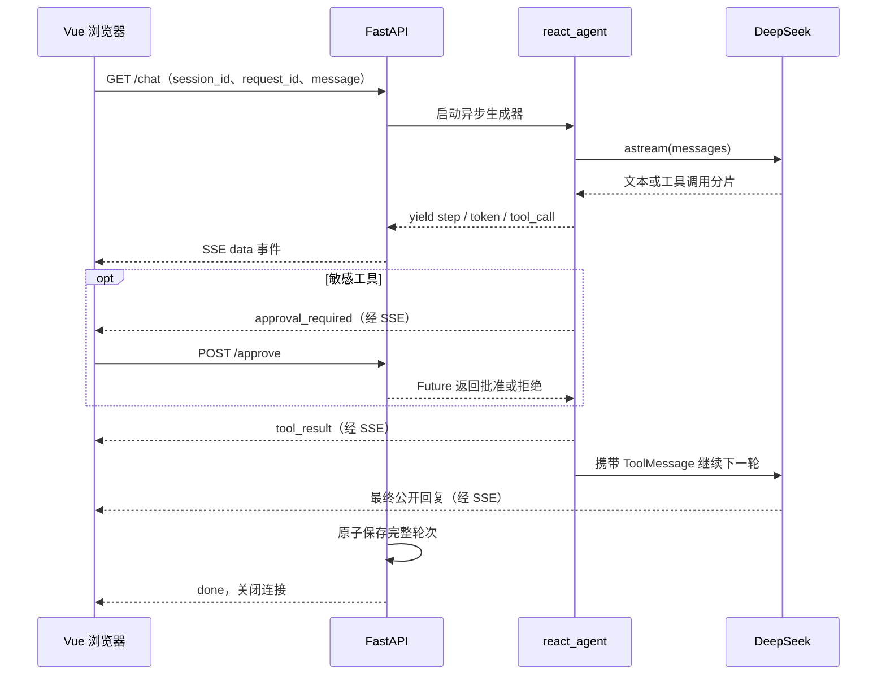

# Week 11 · ReAct Studio

把 Week 10 Day 7 的 CLI Agent 搬上浏览器：输入任务后，实时查看模型公开回复、推理轮次、工具参数和执行结果；敏感操作在浏览器审核后继续执行。

**部署状态：已完成线上部署（维护者确认）。** 在线体验：[ReAct Studio](https://qishuixian.com/messageAgent/)。仓库 [个人主页入口](../index.html) 已添加项目卡片，[根目录 README](../README.md) 已收录在线地址与本周成果。首页入口文件更新后，需要同步到宿主机个人站点的静态目录才能在线上首页显示。

参考 [Week 7 项目](../week7/langchain-project/README.md) 的 FastAPI + Vue 结构，使用 Vue 3、TypeScript、Vite、Element Plus。本周保留 [Week 10 Day 7](../week10/week10_day7.py) 的手写 ReAct 循环，不替换成 `create_agent`。不展示模型内部隐藏思维链。

学习路线：Week 9 建立 LangGraph 的图思维 → Week 10 手写 ReAct 理解执行原理 → Week 11 将 Agent 改造成可交互的 Web 应用。Day 1–7 的功能整合在同一套前后端中，按下表定位学习入口即可。

## 访问方式

| 模式 | 页面地址 | 需要启动的服务 |
| --- | --- | --- |
| 前后端开发 | <http://localhost:8003> | Vite 8003 + FastAPI 8083 |
| 打包后运行 | <http://127.0.0.1:8083> | 先构建前端，再启动 FastAPI 8083 |
| API 文档 | <http://127.0.0.1:8083/docs> | FastAPI 8083 |
| Docker 本机验证 | <http://localhost:8003/messageAgent/> | 前端 Nginx + FastAPI 容器 |
| 线上 Docker 部署 | <https://qishuixian.com/messageAgent/> | 宿主机 HTTPS Nginx + 两个容器 |

本周端口固定为**后端 8083、前端 8003**。建议始终使用同一个页面地址：`localhost`、`127.0.0.1` 和不同端口拥有独立的 localStorage，因此不会共用浏览器里的会话列表。

## 目录与七天产出

```text
week11/
├── backend/
│   ├── main.py          # FastAPI、SSE、审核协调、静态文件托管
│   ├── agent.py         # 异步生成器 react_agent、四种工具
│   ├── store.py         # SQLite，会话隔离与原子提交
│   ├── test_app.py      # 无 API 费用的协议与 Agent 回归测试
│   ├── requirements.txt
│   └── .env.example
└── frontend/
    ├── src/App.vue      # EventSource、打字机、审核弹窗、会话列表
    ├── src/style.css
    └── vite.config.ts   # 8003 → 8083 代理、构建到 backend/static
```

| 天数 | 实现 | 回归入口 |
| --- | --- | --- |
| Day 1 | 异步 ReAct + StreamingResponse | `/chat` 返回 text/event-stream |
| Day 2 | Vue3 + 原生 EventSource | 首页发送问题，收到回复 |
| Day 3 | setInterval 打字机、气泡动画、工具卡片 | 天气与乘法示例 |
| Day 4 | el-dialog + POST /approve | 模拟邮件，批准或拒绝 |
| Day 5 | localStorage 会话列表 + SQLite 历史 | 新建、切换、刷新 |
| Day 6 | 编号轮次、连线、工具结果状态 | 多工具任务 |
| Day 7 | CORS、开发代理、单端口静态部署 | 构建后访问 8083 |

## 本地启动（Windows PowerShell）

要求 Python 3.10+、Node.js 20.19+ 或 22.12+。旧版 Node 14 无法运行本项目。

终端一，从仓库根目录运行：

```powershell
cd week11/backend
python -m venv venv
.\venv\Scripts\python.exe -m pip install -r requirements.txt
if (!(Test-Path .env)) { Copy-Item .env.example .env }
# 编辑 .env：填写你自己的 DEEPSEEK_API_KEY
.\venv\Scripts\python.exe -m uvicorn main:app --host 127.0.0.1 --port 8083 --reload
```

已有 `.env` 时跳过复制，避免覆盖自己的配置。配置项沿用 Week 7：`load_dotenv`、`DEEPSEEK_API_KEY`、`DEEPSEEK_BASE_URL`（默认 `https://api.deepseek.com`）、`MODEL_NAME`（默认 `deepseek-chat`）。模型延迟初始化，没配置密钥也能启动服务和运行测试。

终端二，从仓库根目录运行：

```powershell
cd week11/frontend
npm install
npm run dev
```

- 前端：<http://localhost:8003>
- 后端与接口文档：<http://127.0.0.1:8083/docs>
- 健康检查：<http://127.0.0.1:8083/health>

前端使用同源相对地址，Vite 将 `/chat`、`/approve`、`/sessions`、`/health` 转发至 8083。后端 CORS 仅放行本地 8003 的两个来源。

### 环境变量

在 `backend/.env` 中配置，修改后重启后端。不要将真实密钥提交到 Git。

| 变量 | 默认值 | 用途 |
| --- | --- | --- |
| `DEEPSEEK_API_KEY` | 无 | 调用真实模型必填 |
| `DEEPSEEK_BASE_URL` | `https://api.deepseek.com` | OpenAI 兼容接口地址 |
| `MODEL_NAME` | `deepseek-chat` | 模型名称 |
| `TOOL_TIMEOUT_SECONDS` | `3` | 单次工具执行超时秒数 |
| `APPROVAL_TIMEOUT_SECONDS` | `120` | 等待人工审核的超时秒数 |
| `AGENT_DB_PATH` | `backend/agent_memory.db` 的绝对路径 | SQLite 文件位置，建议自定义时也使用绝对路径 |

`/health` 返回的 `model_configured: true` 只表示已读取到非空密钥，不代表密钥有效或模型服务可达；发送一次任务才能验证真实调用。

## 从 CLI 到异步事件

`agent.py` 改编自 `../week10/week10_day7.py` 的 `react_agent`：仍然是加载历史 → 用户消息 → 最多五轮模型调用 → 合并 chunk → AIMessage → 工具 → ToolMessage → 下一轮。使用 `model.astream()` 和 `full_response += chunk` 合并工具参数分片；每有可展示的信息便 `yield` 事件，服务端将它编码成 `data: JSON\n\n`。

CLI 的 `input()` 审核改成 Future：生成独立 `approval_id`，前端 POST 决定后唤醒 Agent。默认等待 120 秒，超时拒绝，断线清理等待项。工具改为可取消的异步调用，`asyncio.wait_for` 默认 3 秒超时，避免旧版线程池退出仍等待慢任务的问题。



| 接口 | 请求 | 返回 |
| --- | --- | --- |
| POST `/sessions` | `{}` | `{id, title}` |
| GET `/sessions/{id}` | URL 中的会话 ID | `{id, title, turns}` |
| GET `/chat` | `session_id`、`request_id`、`message`（1–2000 字符） | SSE |
| POST `/approve` | `{session_id, approval_id, approved: true/false}` | `{ok: true}` |
| GET `/health` | 无 | 服务状态和是否配置密钥 |

SSE 事件：`step`（轮次）、`token`（公开文本分片）、`tool_call`（工具和参数）、`approval_required`、`approval_result`、`tool_result`、`done`、`error`。无数据时每 15 秒发送注释心跳。前端收到终止或网络错误主动 `EventSource.close()`，避免浏览器自动重连导致重复执行；后端也拒绝已完成的 `request_id`。

同一会话同一时间仅允许一次运行（409），不同会话互不阻塞。界面生成时暂不允许切换或新建，可先停止。完整轮次的模型消息与展示事件在同一 SQLite 事务里保存；异常或取消时不保存半轮上下文。停止发生在完成边界时，服务端可能已保存，重新载入会话即可核对。页面刷新后从后端恢复已完成轮次。

### 前端展示与状态恢复

- `App.vue` 使用浏览器原生 `EventSource` 订阅事件，审核决定通过 `fetch` POST 提交。
- 文本进入缓冲队列，由 `setInterval` 每 20 毫秒显示最多 3 个 Unicode 字符，形成打字机效果；收到 `done` 后仍会显示完剩余文本。
- 工具卡片展示名称、完整参数和执行结果；推理步骤展示轮次编号，审核结果保留在轨迹中。
- 后端保存原始 SSE 展示事件；前端读取历史时合并同一轮连续文本分片，避免刷新后每个分片变成独立段落。
- Element Plus 按需引入按钮、弹窗及消息组件样式，页面布局和动画使用 `style.css`。

## 工具与人工审核

- `get_weather(city)`：北京、上海、广州的固定模拟天气，不联网查询。
- `calculator(a, b)`：两个整数相乘。
- `slow_tool()`：模拟十秒耗时，用于验证三秒超时与降级。
- `send_email(to, subject, body)`：敏感工具，必须审核；仅返回模拟结果，不会发送真实邮件。

审核使用随机 ID 并验证所属会话，重复、过期或跨会话审核返回 409。每一次敏感工具调用都单独审核。拒绝或超时结果作为 ToolMessage 交回模型，模型仍可继续解释结果。

## 回归测试

```powershell
cd week11/backend
.\venv\Scripts\python.exe -m unittest -v test_app
cd ../frontend
npm run build
```

自动测试使用分片假模型驱动真实 ReAct 循环，不调用 DeepSeek。覆盖工具分片合并、SSE 结束、持久化、会话隔离、请求去重、并发拒绝、批准/拒绝、跨会话及重复审核、工具与审核超时、异常回滚、取消清理。

### 已完成的验证（2026-09-10）

| 验证项 | 结果与范围 |
| --- | --- |
| 后端自动测试 | 6 项测试通过；审核测试同时覆盖批准和拒绝两个分支 |
| 前端编译 | `vue-tsc --noEmit` 与 Vite 生产构建通过 |
| 开发代理与 CORS | 通过 8003 访问 `/health` 返回 200；本地 8003 来源的预检请求返回正确的允许来源 |
| 单端口页面 | 8083 成功提供打包后的页面和静态资源 |
| 浏览器审核联调 | 临时测试模型触发审核弹窗，批准后显示模拟工具结果与完成回复 |
| 历史恢复 | 浏览器刷新后恢复完整执行轨迹；文本分片合并后连续显示 |
| 真实模型调用 | 请求“请调用 calculator 计算12乘8，然后简短回答。”，工具返回 `96`，SSE 最后收到 `done` |

以上为实现时的验证记录，不代表每次启动都会自动执行。真实模型验证覆盖计算器链路；邮件审核的浏览器验证使用测试模型，未发送真实邮件。

真实模型人工回归（需有效密钥）：

1. 输入“查询北京天气，再计算 12 × 8”，检查工具参数、结果 96、逐字回复与轮次编号。
2. 点击模拟邮件示例发送，检查弹窗参数；分别批准和拒绝，确认执行结果一致。
3. 再次发起审核并等待 120 秒，应自动拒绝；然后再次发送问题，确认会话没有锁死。
4. 输入“调用 slow_tool 测试超时降级”，约三秒后出现超时结果，模型继续回复。
5. 新建两个会话，分别说明不同昵称并追问；切换和刷新后历史应互不混淆。
6. 生成过程中点击停止或刷新页面，再进入该会话；未完成轮次不应污染后续模型上下文。
7. 停掉后端后发送消息，检查连接错误提示；恢复后重新载入会话并发送。

## Day 7：打包与单端口部署

```powershell
cd week11/frontend
npm ci
npm run build
cd ../backend
.\venv\Scripts\python.exe -m uvicorn main:app --host 127.0.0.1 --port 8083
```

构建自动写入 `backend/static`，必须先构建再启动/重启后端。此时只访问 <http://127.0.0.1:8083>，无需启动 Vite，页面与 API 同源。部署时复制 backend（包括 static，不包括本地 venv、数据库和密钥），在目标机器安装依赖并单独配置 `.env`。

当前定位为本机学习应用，无账号认证；session_id 是隔离键，不是权限系统。不要直接开放到公网；公开部署需增加认证、会话所有权检查、限流与 HTTPS。审核 Future 和运行锁在进程内，使用默认单 worker；多 worker 需要 Redis 等共享协调。若配置 Nginx，SSE 路径需 `proxy_buffering off`、`proxy_cache off`、`proxy_read_timeout 300s`。原生 EventSource 使用 GET，问题会出现在 URL 中，生产环境应改为 POST 创建任务、GET 使用随机任务 ID 订阅，并避免记录敏感查询参数。

`npm run preview` 只预览前端构建产物，没有配置后端 API 代理，不能替代上面的单端口联调方式。需要完整功能时使用 `npm run dev` 或直接访问 FastAPI 托管的 8083 页面。

## 常见问题

| 现象 | 检查与处理 |
| --- | --- |
| Vite 启动失败、Node API 不兼容 | 执行 `node --version`，使用 Node 20.19+；本次构建使用 Node 24，系统旧版 Node 14 不适用 |
| 页面提示尚未配置模型 | 检查 `backend/.env` 中的密钥是否非空，重启后端，再刷新页面 |
| 已配置密钥但调用失败 | 检查后端日志、密钥有效性、模型名称、接口地址和网络；健康检查不验证这些内容 |
| 8083 根路径返回 404 | 先在 frontend 执行 `npm run build`，确认生成 `backend/static/index.html`，然后重启后端 |
| 8003 启动提示端口占用 | Vite 开启了 `strictPort`，不会自动换端口；关闭占用 8003 的旧服务后重试 |
| 流中断后没有自动恢复 | 这是防重复执行设计；重新载入会话核对历史后，再提交新任务 |
| 审核返回 409 | 审核可能已处理、超时、取消，或与请求中的会话不匹配；检查当前轮次状态 |
| 切换地址后会话列表为空 | 浏览器按来源隔离 localStorage，回到原来的主机名和端口查看 |

## Docker 部署到 `/messageAgent/`

参考 Week 7 的前后端双容器部署，线上地址为 **<https://qishuixian.com/messageAgent/>**，维护者已确认部署成功。以下保留完整配置与操作步骤，供后续重建、升级和迁移使用；本节末尾的本机验证记录与线上部署状态分别记录。

### 文件与请求路径

| 文件 | 作用 |
| --- | --- |
| `backend/Dockerfile`、`backend/.dockerignore` | Python 3.11 镜像，只复制运行源码和依赖清单，不打包密钥、数据库或本机虚拟环境 |
| `frontend/Dockerfile`、`frontend/.dockerignore` | Node 22 构建 Vue，Nginx 提供页面；不复制本机依赖和环境文件 |
| `frontend/nginx.message-agent.conf` | 容器静态资源与 API/SSE 转发 |
| `docker-compose.yml` | 从源码构建并启动两个服务 |
| `docker-compose.prod.yml` | 使用已导入的镜像启动，无需上传源码构建 |
| `nginx.messageagent.conf` | 加入宿主机已有 HTTPS `server` 的 location 配置 |

```text
https://qishuixian.com/messageAgent/
  → 宿主机 Nginx（保留 /messageAgent/ 前缀）
  → 127.0.0.1:8003 → 前端容器 Nginx:80
      /messageAgent/             → Vue 页面
      /messageAgent/assets/...   → 静态资源
      /messageAgent/api/chat     → backend:8083/chat（SSE）
      /messageAgent/api/approve  → backend:8083/approve
      /messageAgent/api/sessions → backend:8083/sessions
```

Docker 构建时设置 `VITE_BASE_URL=/messageAgent/` 和 `VITE_API_BASE_URL=/messageAgent/api/`，同时适配资源路径、首页链接、fetch 和 EventSource。普通本地开发及前文 FastAPI 单端口模式仍默认使用根路径。Docker 模式下页面由前端容器提供，8083 仅提供 API。

宿主机代理只匹配 `/messageAgent/`，不会接管站点的全局 `/api/` 或 Week 7 的 `/chatAgent/`。端口绑定在宿主机 `127.0.0.1`，对外入口使用已有 HTTPS Nginx。两层代理均关闭 SSE 缓冲、缓存和压缩，并设置 300 秒读取超时。

### 方式一：在服务器从源码构建

服务器需要 Docker Engine、Compose V2 和已有的 HTTPS Nginx。先进入服务器上的仓库 `week11` 目录，再运行：

```bash
# 首次配置；已有 .env 时保留原配置
test -f backend/.env || cp backend/.env.example backend/.env
# 编辑 backend/.env，填写 DEEPSEEK_API_KEY 等配置
docker compose config --quiet
docker compose up -d --build
docker compose ps
curl -f http://127.0.0.1:8083/health
curl -f http://127.0.0.1:8003/messageAgent/api/health
```

本机也可以从 `week11` 执行相同的 Compose 命令，浏览器访问 <http://localhost:8003/messageAgent/>。先停止占用 8003/8083 的 Vite、Uvicorn 或旧容器；不要同时运行两套服务。

### 方式二：本机构建镜像，上传服务器

在本机仓库 `week11` 目录执行（PowerShell）：

```powershell
docker compose build --builder default
docker save -o message-agent-images.tar message-agent-backend:latest message-agent-frontend:latest
ssh root@<SERVER_IP> "mkdir -p /opt/message-agent/backend"
scp message-agent-images.tar docker-compose.prod.yml nginx.messageagent.conf root@<SERVER_IP>:/opt/message-agent/
scp backend/.env.example root@<SERVER_IP>:/opt/message-agent/backend/.env.example
```

镜像架构必须匹配服务器。默认使用当前 Docker 引擎的平台；例如 ARM 机器向 x86_64 服务器交付时，需要使用 Buildx 为 `linux/amd64` 构建这两个镜像。

**Docker Desktop 构建时出现 `auth.docker.io` 证书域名不匹配：**

如果日志先出现 `booting buildkit`、创建 `buildx_buildkit_default`，随后提示 `certificate is valid for *.facebook.com ... not auth.docker.io`，说明拉取基础镜像的认证请求收到了不属于 Docker Hub 的证书。失败发生在镜像元数据获取阶段；Dockerfile 中被标出的 `FROM nginx:stable-alpine` 是触发拉取的位置，不是应用代码编译错误。

先检查构建器，再明确指定本机 Docker 内置构建器：

```powershell
docker buildx ls
# 本机 default 的 DRIVER 为 docker，已验证以下命令成功
docker compose build --builder default
# 使用已经构建的镜像启动，避免再次触发默认构建流程
docker compose up -d --no-build
```

2026-09-10 本机验证：指定 `--builder default` 后，nginx、node、python 的镜像元数据获取成功，两个应用镜像均构建完成，编译步骤复用了已有缓存。该方式避开了报错的构建器执行路径，并不证明原路径的 DNS/代理配置已修复。

若指定构建器后仍出现同类证书错误，继续检查 Docker Desktop 的代理配置、VPN/网络代理及 DNS/hosts 路由；仅凭证书日志无法确定具体是哪一层改写了连接。不要关闭 TLS 校验或信任这张域名不匹配的证书。其他机器上的构建器名称可能不同，以 `docker buildx ls` 输出为准。

服务器执行：

```bash
cd /opt/message-agent
test -f backend/.env || cp backend/.env.example backend/.env
# 在服务器编辑 backend/.env，填写模型配置
docker load -i message-agent-images.tar
docker compose -f docker-compose.prod.yml config --quiet
docker compose -f docker-compose.prod.yml up -d
docker compose -f docker-compose.prod.yml ps
curl -f http://127.0.0.1:8003/messageAgent/api/health
```

`docker save` 生成的归档和 `data/` 已加入忽略规则。无需上传本机 `.env`、虚拟环境、node_modules 或 SQLite 数据库。

### 宿主机 Nginx 反向代理

完成上面的 Docker 启动后，在**服务器宿主机**配置 Nginx，将线上 `/messageAgent/` 请求转发给宿主机 `8003` 端口上的前端容器。前端容器再负责静态页面和 API/SSE 转发，宿主机无需单独配置全局 `/api/`。

**第一步：找到正在生效的站点配置。**

```bash
sudo nginx -T
```

在输出中找到 `server_name qishuixian.com;` 对应的 HTTPS `server` 块及其所属文件。常见位置是 `/etc/nginx/sites-enabled/`、`/etc/nginx/conf.d/`，宝塔环境可能位于 `/www/server/panel/vhost/nginx/`；以 `nginx -T` 实际输出为准，不要另建一个同域名的重复 `server`。

**第二步：在已有 HTTPS `server { ... }` 内添加以下配置。**

保留原有 `listen 443 ssl`、域名、证书和其他应用配置，把下面两个 `location` 放在 `server` 内，与其他 `location` 平级：

```nginx
# https://qishuixian.com/messageAgent → 补齐尾斜杠
location = /messageAgent {
    return 301 /messageAgent/;
}

# https://qishuixian.com/messageAgent/ → Week 11 前端容器
location ^~ /messageAgent/ {
    # 此处不加尾斜杠，保留完整的 /messageAgent/ 请求路径
    proxy_pass http://127.0.0.1:8003;
    proxy_http_version 1.1;
    proxy_set_header Host $host;
    proxy_set_header X-Real-IP $remote_addr;
    proxy_set_header X-Forwarded-For $proxy_add_x_forwarded_for;
    proxy_set_header X-Forwarded-Proto $scheme;
    proxy_set_header Connection "";

    # SSE：避免代理攒满数据后才一次性返回
    proxy_buffering off;
    proxy_cache off;
    proxy_read_timeout 300s;
    gzip off;

    # /chat 使用 GET，查询参数包含用户输入
    access_log off;
}
```


这里必须代理到 **8003 前端容器**；8083 是后端 API 端口，不提供 Docker 版前端页面。`proxy_pass http://127.0.0.1:8003;` 不含 URI 部分，会保留 `/messageAgent/` 前缀；若写成 `http://127.0.0.1:8003/`，Nginx 会替换匹配前缀，导致前端容器收到错误路径。

也可以使用仓库提供的 [nginx.messageagent.conf](./nginx.messageagent.conf)，上传至 `/opt/message-agent/` 后，在同一个 HTTPS `server` 内引用：

```nginx
# 放在已有的 server { listen 443 ssl; server_name qishuixian.com; ... } 内
include /opt/message-agent/nginx.messageagent.conf;
```

直接粘贴与 `include` **二选一**，不要重复添加。使用源码部署时，将 include 改成服务器上片段的实际绝对路径。该文件只有 `location`，不能直接放到 Nginx 顶层或 `http` 块中，也不能作为完整站点文件覆盖现有配置。

**第三步：先验证容器入口，再检查配置并重载 Nginx。**

```bash
# 在宿主机验证前端容器及内部 API 转发
curl -I http://127.0.0.1:8003/messageAgent/
curl -f http://127.0.0.1:8003/messageAgent/api/health

# 只有语法检查成功才执行重载
sudo nginx -t && sudo systemctl reload nginx

# 最后验证 HTTPS 入口
curl -I https://qishuixian.com/messageAgent/
curl -f https://qishuixian.com/messageAgent/api/health
```

如果 Nginx 由宝塔等面板管理，语法检查通过后使用面板的“重载配置”；未使用 systemd 时，可执行 `sudo nginx -s reload`。命令需指向当前运行实例对应的 Nginx。

页面入口：<https://qishuixian.com/messageAgent/>。`/messageAgent` 会重定向到带尾斜杠的路径，缺失的静态资源返回 404，避免错误地返回 HTML。

若容器入口正常而域名返回 404，检查是否编辑了生效的 HTTPS 站点并成功重载；返回 502 时检查 `docker compose ps` 和宿主机 8003 端口；回复一次性出现时检查宿主机与容器两层 Nginx 的 `proxy_buffering off` 是否都生效。

### 数据持久化、升级与验收

SQLite 挂载到部署目录的 `data/agent_memory.db`，容器重建后保留。不要删除 `data/`；需要备份时先停止 backend，再复制数据库文件，完成后启动 backend。当前审核和运行锁在内存中，后端保持默认单进程运行，不要添加多个 worker 或扩容副本。

源码更新后执行 `docker compose up -d --build`；镜像交付则重新 `docker load` 后执行 `docker compose -f docker-compose.prod.yml up -d`。仅修改 `backend/.env` 时，可执行对应 Compose 命令的 `up -d --force-recreate backend frontend`。Compose 需要 2.17+，已设置依赖服务更新时重启前端，使 Nginx 重新解析后端容器地址。重建会中断执行中的对话，先等待现有任务结束。

验收清单：

1. 打开线上入口，确认 JS/CSS 请求位于 `/messageAgent/assets/`，页面无空白和资源 404。
2. 新建会话并发送乘法任务，确认请求位于 `/messageAgent/api/chat`，回复逐步出现，而不是全部生成后一次出现。
3. 发起模拟邮件，分别测试批准和拒绝；POST 地址应为 `/messageAgent/api/approve`。
4. 刷新页面、切换会话，检查历史恢复；重建容器后，同一浏览器来源仍能读取已保存会话。
5. 如果本机 8003 路径可访问而域名不可访问，检查宿主机启用的站点文件和 Nginx 重载结果；若流被缓冲，检查两层代理是否都使用本项目配置。

容器日志：`docker compose logs --tail=100 backend frontend`（镜像部署加 `-f docker-compose.prod.yml`）。API 代理及 Uvicorn 已关闭访问日志，避免 SSE 查询字符串中的用户问题被常规访问日志记录。应用目前没有账号认证，上线前需要在网关增加访问控制；session_id 只用于会话隔离。

本次 Docker 验证记录（2026-09-10）：两个镜像实际构建成功，Compose 配置及两份 Nginx 配置通过检查；在临时端口启动容器后，验证了子路径重定向、HTML/JS/CSS、资源 404、API 转发和真实模型计算器 SSE。浏览器通过 `/messageAgent/` 发起模拟邮件，审核拒绝成功回传，模型继续完成回复。临时测试使用独立数据卷，不占用开发服务的 8003/8083，也未修改线上 Nginx。

随后重建两个测试容器，刷新浏览器仍能恢复完整会话和审核轨迹，验证了数据卷持久化。测试容器与临时数据卷已清理，构建镜像保留在本机。

## 当前边界与后续扩展

默认数据库在 `backend/agent_memory.db`，可用 `AGENT_DB_PATH` 调整。前端会话索引保存在当前浏览器 localStorage，清除浏览器数据后不会自动找回会话列表；SQLite 数据仍在。当前完整读取会话历史，长对话的上下文压缩、跨设备会话列表和执行中断后的续传留待后续扩展。
